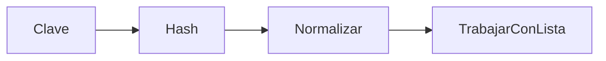

# Intro

Las tablas de hash, también conocidas como tablas hash o mapas hash, son [[Estructura de datos]] que permiten almacenar y recuperar información de manera eficiente mediante el uso de una función hash. La [[#Función de hash]] toma como entrada una clave (key) y produce un índice o valor de hash que indica la posición en la tabla donde se almacena el valor asociado a dicha clave.

![[Pasted image 20230318111041.png]]

Las tablas de hash son útiles para resolver problemas que requieren búsquedas rápidas, inserciones y eliminaciones, ya que proporcionan tiempos de acceso casi constantes en promedio (O(1)) 🚀.

# TAD Tabla vs Tabla de hash

Las tablas de hash es una de las formas mas populares para poder implementar el TAD [[Tabla]] ya que ofrecen implementar este TAD con O(1)cp en sus operaciones. 

# Función de hash

En el contexto de una tabla de hash, una función de hash es una función matemática que toma una entrada (como una cadena de texto o un objeto) y devuelve un valor de hash ==único== y ==determinístico==.

Este valor de hash se utiliza como índice en la tabla de hash para identificar dónde se debe almacenar la entrada. En otras palabras, la función de hash convierte la entrada en un número que se puede utilizar como dirección en la tabla de hash para acceder a la ubicación donde se encuentra almacenada la entrada correspondiente.

## Una buena función de hash 😎

Para que una función de hash se pueda considerar buena debe cumplir:

1.  **Distribución uniforme**: Una buena función de hash debe distribuir las claves de manera uniforme en el espacio de la tabla de hash, reduciendo así la probabilidad de [[#Colisiones 💢]]

2.  **Eficiencia**: La función de hash debe ser rápida de calcular, para que no se convierta en un cuello de botella en el rendimiento general de la tabla de hash. Por lo que tiene que tener O(1)pc. Por lo general si la entrada (key) es grande, se puede truncar a los efectos de no perder el orden.

3.  **Sensibilidad a cambios en la clave**: Si dos claves son ligeramente diferentes, la función de hash debe generar valores de hash muy diferentes, lo que ayuda a minimizar las colisiones. Esto se conoce como [efecto avalancha](https://es.wikipedia.org/wiki/Efecto_avalancha) 🏔️.

## Ejemplos

```cpp
#include <string>

int hash(std::string input) {
    int hash_val = 0;
    for (char c : input) {
        hash_val += c; // Suma el valor ASCII de cada carácter
    }
    return hash_val;
}
```

```cpp
int hash(int input) {
    return input % 100; // se queda con los dos ultimos digitos
}
```

```cpp
#include <string>

int hash(std::string input) {
    int hash_val = 0;
    for (char c : input) {
        hash_val = hash_val * 31 + c; // Algoritmo de hash básico
    }
    return hash_val;
}
```


## Normalización

La normalización de la función de hash en el contexto de las tablas de hash se refiere al proceso de convertir el valor de hash generado por la función de hash en un **índice válido dentro del rango de la tabla de hash**. Esto se hace típicamente al aplicar la operación de módulo (%) al valor de hash generado por la función de hash, pero también puede que se aplique el valor absoluto si a función de hash podría llegar a retornar un numero negativo.

Por ejemplo, si se tiene una tabla de hash con capacidad para 100 celdas y se genera un valor de hash para un elemento determinado que es 105, la normalización de la función de hash consistiría en aplicar la operación de módulo 100 al valor de hash, lo que resultaría en un índice válido de 5 dentro de la tabla de hash.

## Función de hash perfecta

Es una función de hash que asigna de manera **única cada elemento de un conjunto de entradas a un valor de hash sin colisiones**, es decir, sin que dos elementos diferentes tengan el mismo valor de hash. En otras palabras, una función de hash perfecta garantiza que no haya colisiones en la tabla de hash y que cada elemento se pueda recuperar de forma eficiente en tiempo constante **O(1) peor caso**.

Una función de hash perfecta **es muy difícil de obtener en la práctica**, especialmente para conjuntos de entrada grandes y complejos, como las cadenas de texto y los objetos. Por lo tanto, la mayoría de las funciones de hash utilizadas en la práctica son funciones de hash que tienen una probabilidad muy baja de colisiones y que se pueden optimizar para un rendimiento óptimo en términos de tiempo y espacio.

# Factor de carga (λ)

El factor de carga es un concepto importante en las tablas de hash que indica la cantidad de elementos que se han almacenado en la tabla en relación con la cantidad de celdas disponibles en la misma. **Se calcula dividiendo el número de elementos almacenados en la tabla de hash por el tamaño total de la tabla**.

Por ejemplo, si una tabla de hash tiene una capacidad de 100 celdas/buckets y se han almacenado 75 elementos, el factor de carga de la tabla sería 0.75.

**El factor de carga es importante porque afecta directamente el rendimiento de la tabla de hash**. Cuando el factor de carga es bajo y tenemos [[#Una buena función de hash 😎]], el rendimiento de la tabla es alto ya que cada elemento se puede recuperar en tiempo constante sin colisiones (**en promedio**). Sin embargo, **a medida que se agregan más elementos a la tabla, el factor de carga aumenta y la probabilidad de colisiones también aumenta**, lo que reduce el rendimiento de la tabla.

Por lo tanto, es importante controlar el factor de carga de la tabla de hash y ajustar la capacidad de la tabla ([[#Rehash]]) según sea necesario para mantener el factor de carga en un nivel óptimo que permita un rendimiento eficiente y un mínimo de colisiones. En general, se recomienda mantener el factor de carga por debajo de 0.7 para minimizar la probabilidad de colisiones y optimizar el rendimiento de la tabla de hash. 

Si el factor de carga es demasiado bajo, significa que hay muchas celdas vacías en la tabla de hash, lo que puede desperdiciar memoria y disminuir la eficiencia del uso de los recursos. **Por lo cual un buen rango de factor de carga se puede encontrar entre 0,5 y 0,7**.

# Colisiones 💢

Las colisiones en las tablas de hash ocurren cuando dos o más claves diferentes producen el mismo indice para trabajar (luego de normalizar la función de hash). Cuando se produce una colisión, es necesario emplear técnicas para manejarlas y permitir que las claves con el mismo valor de hash sean almacenadas y recuperadas de manera adecuada y eficiente.

> [!caution]
> No necesariamente dos claves que dan el mismo indice es porque tienen el mismo valor al aplicar la función de hash. Por ejemplo: si h(x)=7 , h(y)=17 y mi tabla de hash tiene tamaño 10, entonces ambas terminan en el index 7 (por su [[#Normalización]]).

Existen dos enfoques principales para manejar colisiones en tablas de hash:

1) **Hash abierto** (Separate Chaining): En esta técnica, cada posición en la tabla de hash contiene una lista enlazada (o alguna otra estructura de datos lineal, como un árbol binario de búsqueda) y los elementos de la tabla de hash se almacenan en esas listas.
   
2) **Hash cerrado** (Open Addressing): En esta técnica, todos los elementos se almacenan directamente en la tabla de hash y no se utilizan estructuras adicionales como listas enlazadas.

## Hash abierto

Cada posición en la tabla de hash contiene una estructura de datos (por lo general, una lista enlazada) para almacenar los pares clave-valor que tienen el mismo valor de hash. Al buscar, insertar o eliminar un par clave-valor, se utiliza la función de hash para encontrar la posición en la tabla de hash y luego **se realiza la operación correspondiente en la lista enlazada de esa posición**.

![[DeepinScreenshot_select-area_20230318151027.png]]

Aquí hay una descripción general de cómo funcionan las operaciones básicas :

1.  **Inserción**: Se calcula el valor de hash de la clave y se localiza la posición en la tabla de hash. Luego, se inserta el par clave-valor en la lista enlazada asociada a esa posición.
   
   > [!attention]
   > Es importante recorrer la lista en caso que la clave no existe previamente.

2.  **Búsqueda**: Al buscar una clave, se calcula su valor de hash y se localiza la posición en la tabla de hash. A continuación, se busca la clave en la lista enlazada de esa posición.

3.  **Eliminación**: Para eliminar un par clave-valor, se calcula el valor de hash de la clave y se localiza la posición en la tabla de hash. Luego, se busca y elimina el par clave-valor de la lista enlazada en esa posición.

Como se podrá notar, todas las operaciones siguen el patrón:

Es decir:
1) La clave se hashea.
2) Se normaliza para obtener un index valido de la tabla.
3) Se trabaja (==insertar==/==buscar==/==eliminar==) con la lista que se encuentra en dicho index.

### Orden

El rendimiento de una tabla de hash con hash abierto depende en gran medida de la calidad de la función de hash y del tamaño de la tabla. Si la función de hash distribuye bien los valores y el tamaño de la tabla es adecuado, la tabla de hash puede mantener un rendimiento eficiente en promedio, incluso cuando se producen colisiones.

Sin embargo, **si hay muchas colisiones y las listas enlazadas se vuelven demasiado largas**, las operaciones en la tabla de hash podrían degradarse hacia un rendimiento similar al de una búsqueda lineal.

### Implementación 

```cpp
#include <iostream>

template<typename K, typename V>
class HashTable {
public:
    struct NodeList {
        K key;
        V value;
        NodeList* next;
    };
    
    // Constructor que recibe una función hash
    HashTable(int capacity, unsigned int (*hash_func)(const K&)) :
        capacity_(capacity),
        hash_func_(hash_func),
        size_(0),
        table_(new NodeList*[capacity_])
    {
        for (int i = 0; i < capacity_; ++i) {
            table_[i] = nullptr;
        }
    }
    
    // Destructor que libera la memoria de la tabla
    ~HashTable() {
        for (int i = 0; i < capacity_; ++i) {
            NodeList* node = table_[i];
            while (node != nullptr) {
                NodeList* next_node = node->next;
                delete node;
                node = next_node;
            }
        }
        delete[] table_;
    }
    
    // Inserta un par clave-valor en la tabla
    void insert(const K& key, const V& value) {
        int index = hash_func_(key) % capacity_;
        NodeList* node = table_[index];
        while (node != nullptr) {
            if (node->key == key) {
                node->value = value;
                return;
            }
            node = node->next;
        }
        node = new NodeList;
        node->key = key;
        node->value = value;
        node->next = table_[index];
        table_[index] = node;
        ++size_;
    }
    
    // Recupera el valor asociado con la clave dada
    V* retrieve(const K& key) {
        int index = hash_func_(key) % capacity_;
        NodeList* node = table_[index];
        while (node != nullptr) {
            if (node->key == key) {
                return &node->value;
            }
            node = node->next;
        }
        return nullptr;
    }
    
    // Elimina el par clave-valor asociado con la clave dada
    bool remove(const K& key) {
        int index = hash_func_(key) % capacity_;
        NodeList* node = table_[index];
        NodeList* prev_node = nullptr;
        while (node != nullptr) {
            if (node->key == key) {
                if (prev_node == nullptr) {
                    table_[index] = node->next;
                } else {
                    prev_node->next = node->next;
                }
                delete node;
                --size_;
                return true;
            }
            prev_node = node;
            node = node->next;
        }
        return false;
    }
    
private:
    int capacity_; // Tamaño de la tabla
    unsigned int (*hash_func_)(const K&); // Función hash
    int size_; // Número de pares clave-valor en la tabla
    NodeList** table_; // Arreglo de punteros a nodos de lista enlazada
};


// Función hash que suma caracteres

unsigned int hash_string(const string &key) {
	unsigned int hash = 0;
	for (int i = 0; i < key.length(); ++i) {
		hash = hash + key[i];
	}
	return hash;
}

int main() {
	// Crea una tabla de hash para cadenas y enteros
	HashTable<std::string, int> table(10, hash_string);
	// Inserta algunos pares clave-valor
	table.insert("Hola", 42);
	table.insert("Mundo", 1337);
	table.insert("!", 31337);
	
	return 0;
}
```

La clase `HashTable` tiene tres variables miembro: `capacity_`, que almacena el tamaño de la tabla de hash; `hash_func_`, un puntero a una función hash que se utiliza para calcular el índice de la tabla de hash para una clave dada; `table_`, un puntero a un arreglo de punteros a nodos de lista enlazada que se utiliza para almacenar los pares clave-valor; y `size_`, que almacena la cantidad de elementos dentro de la tabla (útil para calcular el [[#Factor de carga (λ)]]).

El constructor de la clase `HashTable` toma dos argumentos: el tamaño de la tabla de hash y un puntero a una función hash. En el cuerpo del constructor, se inicializan las variables miembro y se asigna memoria dinámica al arreglo de punteros a nodos de lista enlazada.

La función `insert` se utiliza para insertar un par clave-valor en la tabla de hash. La función primero calcula el índice de la tabla de hash para la clave dada utilizando la función hash, y luego busca en la lista enlazada en ese índice para ver si la clave ya existe en la tabla de hash. Si la clave ya existe, la función actualiza el valor correspondiente; de lo contrario, la función crea un nuevo nodo en la lista enlazada y lo agrega al principio de la lista enlazada.

La función `retrieve` se utiliza para recuperar el valor asociado con una clave dada en la tabla de hash. La función primero calcula el índice de la tabla de hash para la clave dada utilizando la función hash, y luego busca en la lista enlazada en ese índice para encontrar el nodo correspondiente. Si se encuentra el nodo, la función devuelve un puntero al valor correspondiente; de lo contrario, la función devuelve un puntero nulo.

La función `remove` se utiliza para eliminar el par clave-valor asociado con una clave dada en la tabla de hash. La función primero calcula el índice de la tabla de hash para la clave dada utilizando la función hash, y luego busca en la lista enlazada en ese índice para encontrar el nodo correspondiente. Si se encuentra el nodo, la función lo elimina de la lista enlazada y libera la memoria del nodo. La función devuelve `true` si se eliminó el nodo y `false` si la clave dada no se encontró en la tabla de hash.

## Hash cerrado

En lugar de usar estructuras de datos adicionales para manejar las colisiones, como sucede en el método de [[#Hash abierto]] (donde se utilizan listas enlazadas para almacenar múltiples elementos en el mismo bucket), el hash cerrado utiliza **el propio arreglo de buckets como estructura de datos para manejar las colisiones**.

![[Pasted image 20230318160911.png]]

Para encontrar un bucket diferente para almacenar un elemento adicional, se utilizan diferentes técnicas de sondas (como sondas lineales, sondas cuadráticas o doble hashing). Cada técnica utiliza una función para calcular la siguiente sonda en el arreglo, y la sonda se calcula en base al índice del bucket original y a alguna información sobre el elemento que se está almacenando (como su función hash).

### Estrategias / sondas

Las sondas son utilizadas en las tablas de hash con hash cerrado para buscar el siguiente bucket disponible en caso de colisiones.

-   **Lineal**: La sonda lineal es la técnica más simple de hash cerrado. Esta técnica utiliza una función que incrementa de uno en uno el índice del bucket en el arreglo hasta encontrar el siguiente bucket disponible. La sonda lineal es fácil de implementar y es eficiente en el caso de que la tasa de ocupación de la tabla sea baja. Sin embargo, en el caso de alta tasa de ocupación, puede haber una gran cantidad de colisiones y el rendimiento de la sonda lineal puede deteriorarse significativamente.

-  **Cuadrática**: La sonda cuadrática es una técnica que utiliza una función cuadrática para buscar el siguiente bucket disponible en el arreglo. En lugar de incrementar de uno en uno el índice del bucket, la sonda cuadrática utiliza una función cuadrática para calcular la siguiente sonda. La sonda cuadrática es más eficiente que la sonda lineal en el caso de alta tasa de ocupación, ya que distribuye mejor los elementos en el arreglo y reduce la cantidad de colisiones. Sin embargo, esta técnica puede tener problemas en el caso de que se produzcan secuencias de colisiones, lo que puede resultar en una búsqueda prolongada de un bucket disponible.

-  **Doble Hash**: La técnica de doble hash utiliza dos funciones hash para calcular la siguiente sonda. La primera función hash se utiliza para calcular la posición inicial del bucket y la segunda función se utiliza para calcular la distancia desde la posición inicial hasta el siguiente bucket disponible.

> [!Attention]
> Es importante tener en cuenta el quedarnos en loop. El caso mas básico es si la tabla esta llena, debemos prever esta situación. De todas maneras, existen casos mas complejos, donde sondeo como el **cuadratico** o **doble hash** revisan periódicamente los mismos buckets sin poder pasar por aquellos que están libre. Es por eso recomendable usar tablas con tamaño primo donde ayudan a reducir esta situación. De todas maneras siempre **una detección de loop es recomendable**.

### Borrado

El borrado en hash cerrado es difícil porque, a diferencia del método de hash abierto, en el que se pueden simplemente eliminar los elementos de la lista enlazada que corresponden a un bucket, en hash cerrado el borrado **puede afectar la capacidad de la tabla de hash para buscar elementos en el futuro**.

Cuando se elimina un elemento de la tabla de hash con hash cerrado, **no se puede simplemente eliminar el elemento del bucket correspondiente**, ya que esto podría afectar las sondas futuras en caso de colisiones. En cambio, se debe marcar el bucket como "eliminado" utilizando una marca especial, como establecer el campo "deleted" en true en la estructura de nodo. De esta forma, el bucket se considera vacío y se puede utilizar para almacenar nuevos elementos en el futuro.

El problema es que, a medida que se eliminan elementos de la tabla de hash, aumenta la cantidad de buckets marcados como "eliminados". Si no se realiza una reorganización periódica de la tabla de hash ([[#Rehash]]) para eliminar los buckets marcados como "eliminados" entonces la performance podría disminuir, ya que a excepción de la inserción, todos los otros métodos (recuperar/eliminar) asumen que esta celda esta "ocupada" en su búsqueda.

Lectura recomendada: https://stackoverflow.com/questions/9127207/hash-table-why-deletion-is-difficult-in-open-addressing-scheme

### Implementación

```cpp
#include <iostream>
#include <cstring>

template<typename K, typename V>
class HashTableOpenAddressing {
public:
    struct HashNode {
        K key;
        V value;
        bool empty;
        bool deleted;
    };
    
    // Constructor que recibe una función hash
    HashTableOpenAddressing(int capacity, unsigned int (*hash_func)(const K&)) :
        capacity_(capacity),
        hash_func_(hash_func),
        size_(0),
        table_(new HashNode[capacity_]),
        deleted_(new bool[capacity_])
    {
        for (int i = 0; i < capacity_; ++i) {
            table_[i].empty = true;
            table_[i].deleted = false;
            deleted_[i] = false;
        }
    }
    
    // Destructor que libera la memoria de la tabla
    ~HashTableOpenAddressing() {
        delete[] table_;
        delete[] deleted_;
    }
    
    // Inserta un par clave-valor en la tabla
    void insert(const K& key, const V& value) {
        if (size_ == capacity_) {
            std::cerr << "Error: table is full" << std::endl;
            return;
        }
        int index = hash_func_(key) % capacity_;
        int i = 0;
        while (!table_[index].empty && table_[index].key != key) {
            index = (index + 1) % capacity_;
            ++i;
            if (i == capacity_) {
                std::cerr << "Error: table is full" << std::endl;
                return;
            }
        }
        if (table_[index].empty || table_[index].deleted) {
            table_[index].key = key;
            table_[index].value = value;
            table_[index].empty = false;
            table_[index].deleted = false;
            ++size_;
        } else {
            table_[index].value = value;
        }
    }
    
    // Recupera el valor asociado con la clave dada
    V* retrieve(const K& key) {
        int index = hash_func_(key) % capacity_;
        int i = 0;
        while (!table_[index].empty) {
            if (!table_[index].deleted && table_[index].key == key) {
                return &table_[index].value;
            }
            index = (index + 1) % capacity_;
            ++i;
            if (i == capacity_) {
                break;
            }
        }
        return nullptr;
    }
    
    // Elimina el par clave-valor asociado con la clave dada
    bool remove(const K& key) {
        int index = hash_func_(key) % capacity_;
        int i = 0;
        while (!table_[index].empty) {
            if (!table_[index].deleted && table_[index].key == key) {
                table_[index].deleted = true;
                --size_;
                return true;
            }
            index = (index + 1) % capacity_;
            ++i;
            if (i == capacity_) {
                break;
            }
        }
        return false;
    }
    
private:
    int capacity_; // Tamaño de la tabla
    unsigned int (*hash_func_)(const K&); // Función hash
    int size_; // Número de pares clave-valor en la tabla 
    HashNode* table_; // Arreglo de nodos de tabla de hash 
    bool* deleted_; // Arreglo para marcar los buckets eliminados };
};

// hash_string imp

unsigned int hash_string(const std::string& str) {
	unsigned int hash = 0;
	for (int i = 0; i < str.length(); ++i) {
		hash = hash * 31 + str[i];
	}
	return hash;
}

int main() {
	// Crea una tabla de hash para cadenas y enteros
	HashTableOpenAddressing<std::string, int> table(10, hash_string);
	// Inserta algunos pares clave-valor
	table.insert("Hola", 42);
	table.insert("Mundo", 1337);
	table.insert("!", 31337);
	return 0;
}
```

En esta implementación de la tabla de hash con hash cerrado, los nodos de la tabla se representan mediante la estructura `HashNode`, que contiene tres campos: `key`, `value`, y dos campos booleanos: `empty` y `deleted`.

El campo `key` es la clave del elemento almacenado en el bucket, el campo `value` es el valor asociado con la clave, el campo `empty` indica si el bucket está vacío o no, y el campo `deleted` indica si el bucket ha sido eliminado o no.

La clase `HashTableOpenAddressing` tiene una serie de métodos para operar con la tabla de hash, que son:

-   El constructor `HashTableOpenAddressing` que recibe como argumentos el tamaño de la tabla y una función hash.
-   El destructor `~HashTableOpenAddressing` que libera la memoria utilizada por la tabla.
-   El método `insert` que inserta un elemento con una clave y un valor en la tabla.
-   El método `retrieve` que devuelve el valor asociado con una clave dada en la tabla.
-   El método `remove` que elimina el elemento con una clave dada de la tabla.

La función `insert` utiliza una estrategia lineal para encontrar un bucket vacío o el bucket que contiene el elemento con la clave dada. Si se encuentra un bucket vacío, se inserta el elemento en ese bucket. Si se encuentra un bucket que contiene el elemento con la misma clave, se actualiza el valor asociado con la clave.

La función `retrieve` también utiliza una estrategia lineal para buscar el bucket que contiene el elemento con la clave dada. Si se encuentra el bucket, se devuelve un puntero al valor asociado con la clave. Si no se encuentra el bucket, se devuelve un puntero nulo.

La función `remove` utiliza una estrategia lineal para encontrar el bucket que contiene el elemento con la clave dada, y lo marca como eliminado en el arreglo `deleted_`. Esto se hace estableciendo el campo `deleted` del nodo correspondiente en `true`. La eliminación física del elemento no se realiza en este caso, ya que esto podría afectar a las sondas lineales futuras en caso de colisiones.


## Hash abierto vs hash cerrado

La elección entre ambas depende de varios factores, como el rendimiento, la facilidad de implementación, la carga de la tabla y las características de los datos almacenados. A continuación, se detallan algunas pautas generales para elegir entre hash cerrado y hash abierto:

| Factor                | Open Addressing                                          | Chaining                                              |
|-----------------------|-----------------------------------------------------------|-------------------------------------------------------|
| Rendimiento           | Mejor rendimiento con cargas bajas a moderadas           | Mejor rendimiento con cargas altas                   |
| Facilidad de implementación | Más difícil de implementar y ajustar                  | Más fácil de implementar y entender                   |
| Características de los datos | Funciona bien con datos uniformemente distribuidos | Adecuado para datos menos uniformes o con más colisiones |


1. **Rendimiento**
   
	- Open Addressing: Generalmente, ofrece un mejor rendimiento para cargas bajas a moderadas. Sin embargo, a medida que la carga aumenta, las colisiones se vuelven más frecuentes, lo que puede provocar un deterioro del rendimiento.
      
	- Chaining: Tiende a funcionar mejor con cargas más altas, ya que las colisiones se resuelven simplemente agregando elementos a la lista enlazada correspondiente. Sin embargo, si las listas enlazadas se vuelven muy largas, el rendimiento puede verse afectado.
      
      ![[Pasted image 20230318160837.png]]
      
2. **Facilidad de implementación**

	- Open Addressing: Es más difícil de implementar que Chaining debido a la necesidad de elegir y ajustar adecuadamente la función de exploración (sondeo) para evitar la agrupación y las colisiones frecuentes.
	  
	- Chaining: Es más fácil de implementar y entender, ya que solo requiere el uso de listas enlazadas para resolver colisiones.
      
3. **Características de los datos**

	- Si los datos que se almacenan en la tabla hash tienen una distribución uniforme o pueden ser bien distribuidos por la función hash, Open Addressing puede funcionar bien.
	  
	- Si los datos son más propensos a colisiones o tienen una distribución menos uniforme, Chaining puede ser más apropiado.


# Re-hash

El rehashing es un proceso que se realiza en tablas hash **cuando se necesita aumentar o reducir el tamaño de la tabla**. Este proceso es necesario para mantener una carga equilibrada en la tabla y garantizar un rendimiento óptimo. La carga de una tabla hash se define como la relación entre el número de elementos almacenados en la tabla y el tamaño total de la tabla.

Cuando la carga de la tabla hash supera un umbral predefinido (**generalmente entre 0.7 y 1**), se dispara el proceso de rehashing. Este umbral se selecciona para mantener un equilibrio entre el rendimiento y el uso de memoria. Un umbral más bajo dará lugar a un mejor rendimiento pero un mayor uso de memoria, mientras que un umbral más alto permitirá un uso de memoria más eficiente pero un rendimiento potencialmente peor.

El proceso de rehashing consta de los siguientes pasos:

1. Crear una nueva tabla hash de un tamaño mayor (generalmente el doble del tamaño actual o el siguiente número primo más grande).
2. Recorrer todos los elementos de la tabla hash original.
3. Para cada elemento en la tabla hash original, aplicar la función hash al elemento con respecto al tamaño de la nueva tabla.
4. Insertar el elemento en la posición calculada en la nueva tabla hash.
5. Descartar la tabla hash original y reemplazarla por la nueva tabla hash.

> [!info]
> Los elementos de la tabla original no tiene que terminar en los mismo buckets que su tabla de hash original

El rehashing también se puede realizar para reducir el tamaño de la tabla cuando la carga es demasiado baja. Esto puede ser útil para ahorrar memoria cuando hay muchas eliminaciones en la tabla hash (especialmente en el hash cerrado, lease: [[#Borrado]]) y la cantidad de elementos almacenados se reduce significativamente. Sin embargo, el rehashing para reducir el tamaño de la tabla es menos común que el rehashing para aumentar el tamaño.

**Cabe destacar que el rehashing puede ser un proceso costoso en términos de tiempo y recursos**, ya que implica re-calcular las posiciones de todos los elementos en la nueva tabla hash. Por lo tanto, es importante elegir un umbral apropiado y un tamaño de tabla inicial adecuado para minimizar la frecuencia de rehashing y mantener un buen equilibrio entre el rendimiento y el uso de memoria.

# Limitaciones

Aunque las tablas hash son estructuras de datos extremadamente útiles y eficientes en muchos casos, hay situaciones en las que no son la mejor opción. Algunos de los escenarios en los que las tablas hash pueden no ser adecuadas incluyen:

1.  **Ordenamiento**: Las tablas hash no almacenan elementos en un orden específico. Si se requiere mantener o recuperar elementos en un orden particular (por ejemplo, orden alfabético o numérico), una tabla hash no es la mejor opción. En su lugar, se pueden utilizar otras estructuras de datos como arboles [[ABB]] o árboles [[AVL]].

2.  **Búsqueda de rangos**: Las tablas hash no son ideales para realizar consultas de rango, como encontrar todos los elementos dentro de un rango específico de valores. 

3.  **Espacio de memoria limitado**: Aunque las tablas hash pueden ser eficientes en términos de tiempo de búsqueda, inserción y eliminación, su eficiencia en el uso de la memoria puede ser menor en comparación con otras estructuras de datos. Si el uso eficiente del espacio de memoria es crítico, otras estructuras de datos como árboles [[ABB]] o [[Lista simplemente encadenada]] pueden ser más adecuadas.

4.  **Pequeños conjuntos de datos**: Si el conjunto de datos es muy pequeño, la [[Complejidad cognitiva]]  de las tablas hash pueden no ser necesarias. En estos casos, una lista enlazada o un vector podrían ser suficientes.

5.  **Llaves con alta probabilidad de colisiones**: Si las llaves utilizadas en la tabla hash tienen una alta probabilidad de colisiones o una distribución no uniforme, el rendimiento de la tabla hash puede verse afectado. En tales casos, se deben considerar otras estructuras de datos o mejorar la función hash utilizada.

6.  **Tiempo de ejecución constante no garantizado**: Aunque las tablas hash ofrecen un tiempo de ejecución promedio constante para las operaciones de búsqueda, inserción y eliminación, no garantizan un tiempo de ejecución constante en el peor de los casos. Si se requiere un tiempo de ejecución constante garantizado, otras estructuras de datos, como árboles balanceados, podrían ser más adecuadas.


En resumen, aunque las tablas hash son una herramienta poderosa y versátil, no son la mejor opción en situaciones donde se requiere orden, búsquedas de rango, uso eficiente del espacio de memoria o tiempo de ejecución constante garantizado.

# Visualizaciones

- https://visualgo.net/en/hashtable
- https://www.cs.usfca.edu/~galles/visualization/ClosedHash.html
- https://www.cs.usfca.edu/~galles/visualization/OpenHash.html

# Lecturas recomendadas

- https://visualgo.net/en/hashtable/print 
- https://www.geeksforgeeks.org/hashing-data-structure/